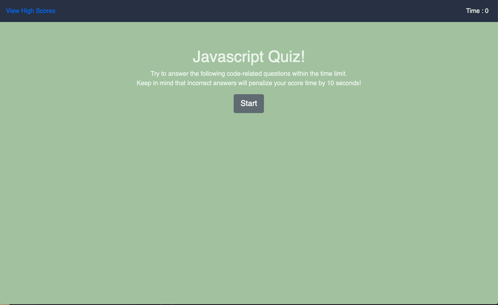

# 04 Web APIs: Code Quiz

## Description

This application is a timed code quiz with multiple-choice questions.   
When the user clicks the start button a timer starts and the user is presented with a question. 
When the user answers the question, then another question is presented. 
If the user answers the question incorrectly, then the time is subtracted from the clock. 
When all questions are answered or the timer reaches 0, then the game is over. 
When the game is over, then the user can save their initials and score. 

## Technologies

* HTML
* CSS
* JAVASCRIPT

## Website

https://dresroldan.github.io/web-api-code-quiz/

